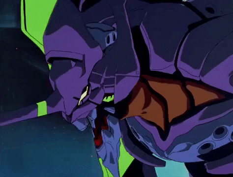
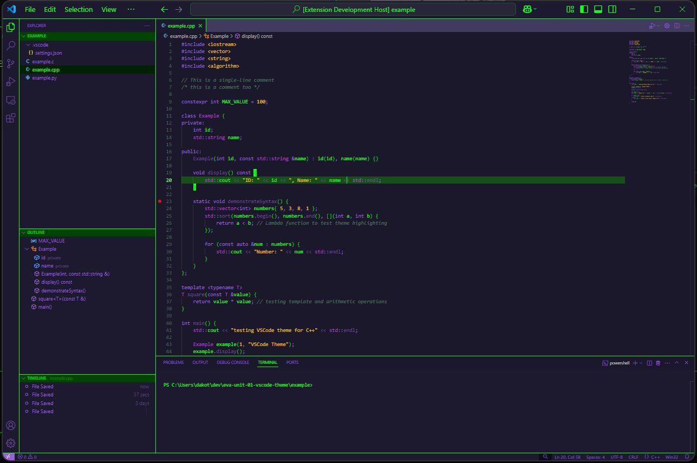

# evangelion unit-01 berserk theme 💜💚

develop in [berserk mode](https://www.youtube.com/watch?v=-olPXm8oJyw) with this evangelion unit-01 (エヴァンゲリオン初号機) inspired theme from the tv series [Neon Geneis Evangelion](https://en.wikipedia.org/wiki/Neon_Genesis_Evangelion) 

## preview

built for C/C++ and python syntax

## installation
1. install and launch [Visual Studio Code](https://code.visualstudio.com/)
2. *Settings* > *Extensions* (or `Ctrl+Shift+X`)
3. search for `evangelion unit-01 berserk theme`
4. click *Install*
5. *Settings* > *Themes* > *Color Theme* > *Matrix Theme*

## issues & feedback
 
 please feel free to suggest changes and fixes on the repository [issues](https://github.com/engrx0/eva-unit01-berserk-vscode-theme/issues) page or reach out directly via any platform listed on my github profile

> [change log](https://github.com/engrx0/eva-unit01-berserk-vscode-theme/blob/main/CHANGELOG.md)
