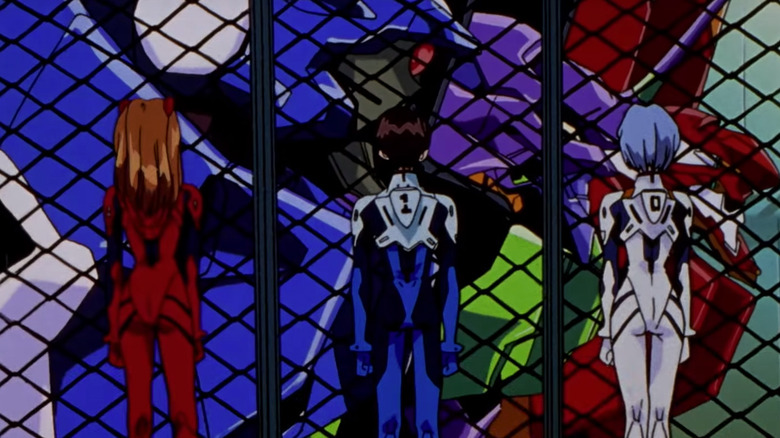

# Neon Genesis Evangelion Themes

The `Neon Genesis Evangelion Themes` extension provides color themes and a file icon theme inspired by Evangelion Unit-00, Unit-01, and Unit-02 from the beloved tv series [Neon Geneis Evangelion](https://en.wikipedia.org/wiki/Neon_Genesis_Evangelion)

## EVA Unit-00
> coming in v0.3.0

## EVA Unit-01 Berserk 💜💚

Develop in [BERSERK MODE](https://www.youtube.com/watch?v=-olPXm8oJyw) with this EVA Unit-01 (エヴァンゲリオン初号機) color theme

### Preview

## EVA Unit-02
> coming in v0.2.0

## File Icon Theme
> coming in v0.4.0

## Installation
1. Install and launch [Visual Studio Code](https://code.visualstudio.com/)
2. *Settings* > *Extensions* (or `Ctrl+Shift+X`)
3. Search for `Neon Genesis Evangelion Themes`
4. Click *Install*
5. *Settings* > *Themes* > *Color Theme* > `EVA Unit-01 Berserk`

## Issues & Feedback
 
 Suggest changes and fixes on the repository [issues](https://github.com/engrx0/eva-unit01-berserk-vscode-theme/issues) page or reach out directly via any platform listed on my github profile. 

 Leave a review on the VS Code theme extension page `^_^`

[change log](https://github.com/engrx0/eva-unit01-berserk-vscode-theme/blob/main/CHANGELOG.md)

## License

This project is licensed under the [MIT License](LICENSE)