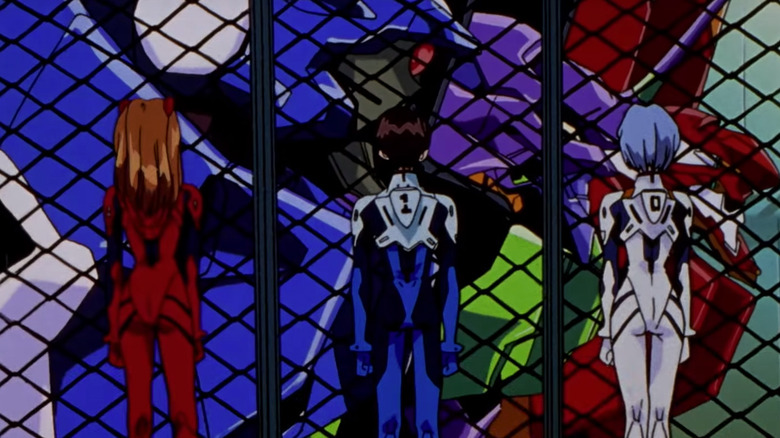
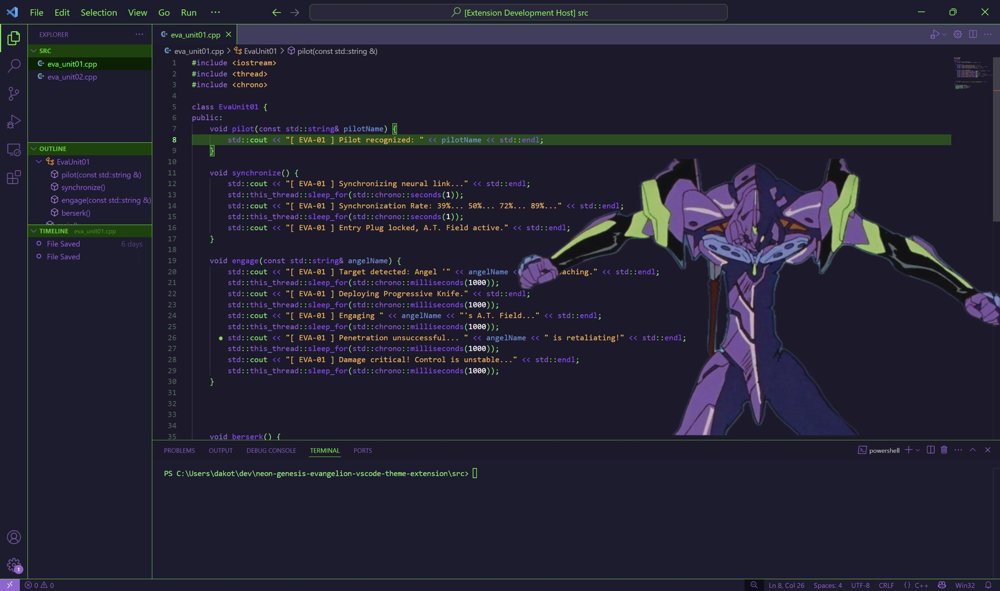
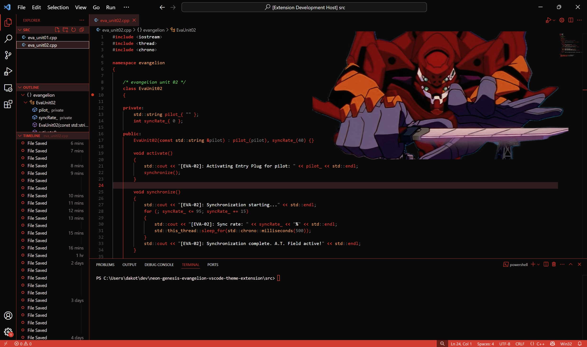

# Neon Genesis Evangelion Themes

## EVA Unit-00
> coming in v0.3.0

## EVA Unit-01 Berserk 💜💚

Develop in [BERSERK MODE](https://www.youtube.com/watch?v=-olPXm8oJyw) with this EVA Unit-01 (エヴァンゲリオン初号機) color theme

## EVA Unit-02 ❤️‍🔥

Honor the [death of Asuka and Unit 02](https://www.youtube.com/watch?v=OO-1Yyi5KPY) with this EVA Unit-02 (エヴァンゲリオン弐号機) color theme

## Installation
1. Install and launch [Visual Studio Code](https://code.visualstudio.com/)
2. *Settings* > *Extensions* (or `Ctrl+Shift+X`)
3. Search for `Neon Genesis Evangelion Themes`
4. Click *Install*
5. *Settings* > *Themes* > *Color Theme* >  `EVA Unit-01 Berserk` \ `EVA Unit-02`

## Issues & Feedback
 
 Suggest changes and fixes on the repository [issues](https://github.com/engrx0/eva-unit01-berserk-vscode-theme/issues) page or reach out directly via any platform listed on my github profile. 

 Leave a review on the VS Code theme extension page `^_^`

[change log](https://github.com/engrx0/eva-unit01-berserk-vscode-theme/blob/main/CHANGELOG.md)

## License

This project is licensed under the [MIT License](LICENSE)